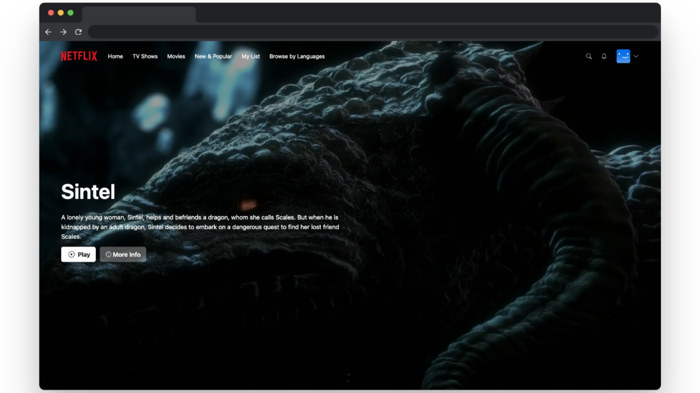

# Netflix Clone

## Table of Contents

- [Live Site](#live-site)

- [Tech Stack](#tech-stack)

- [Usage](#usage)

- [Description](#description)

## Live Site

[Click here to view live site](https://netflix-clone-zachshouts.vercel.app/)

## Usage

Sign into the live site with a preset account:

- Email - test@gmail.com
- Password - test1234

## Tech Stack

- React

- Next.js

- TypeScript

- MongoDB

- Prisma

- TailwindCSS

- Deployed to Vercel

## Description

While debating over what I wanted to be my next project, I decided to recreate something I'm sure many of us are very familiar with. This app providing me with a ton of knowledge on TypeScript and Next.js, as well as another opportunity to develop my skills in React further. This is only the start and I'm exciting to continue working with these technologies.

